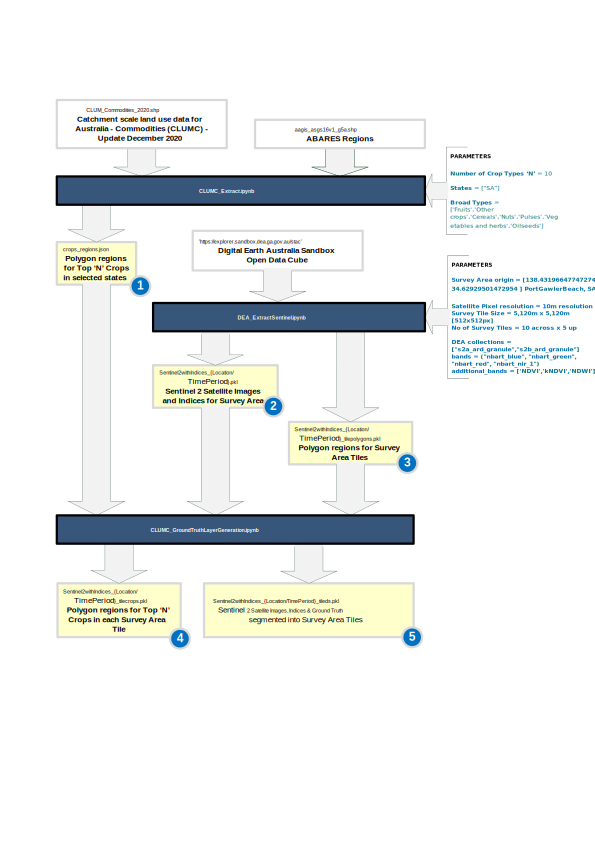

# DEA Multi-Spectral Imaging Tools
#### Repo: https://github.com/ascidian-ai/DEA_MultiSpectralImageTools

Tools to support image extraction and preparation of Digital Earth Australia (DEA) Satellite Multi-Spectral Images for use in Deep Learning Models.

*Figure 1 : Example Data Processing Pipeline for Research Project*
